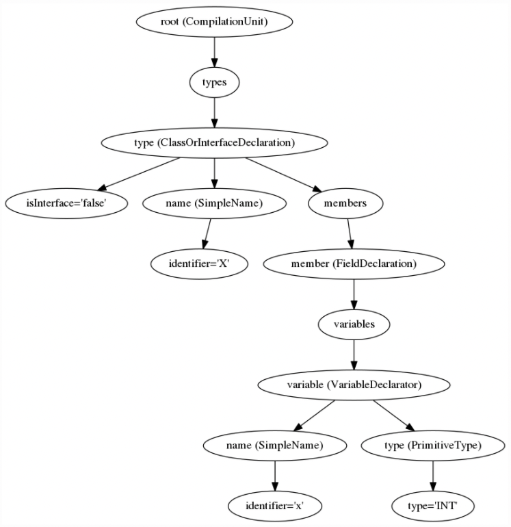
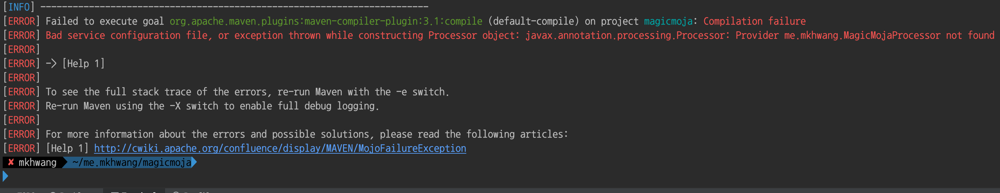
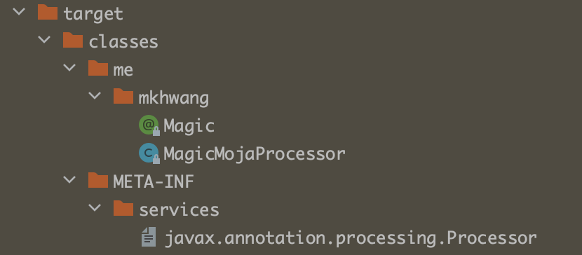
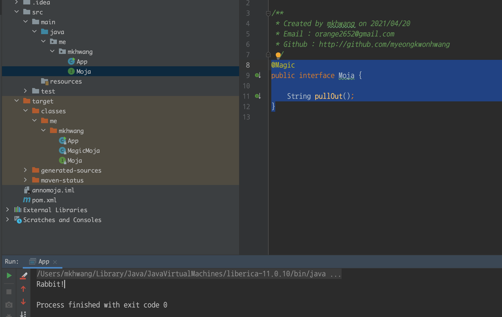

# 애노테이션 프로세서

---

## 롬복은 어떻게 동작할까?

- 컴파일 시점에 애노테이션 프로세서를 사용하여 소스코드의 [AST]([https://javaparser.org/inspecting-an-ast/](https://javaparser.org/inspecting-an-ast/))(abstract syntact tree)를 조작한다.

## 구현해보기

Java version 6부터 제공하는 annotation Processo를 통해 구현

만들어볼 Project는 2개 이다.

- annomoja → 실제 인터페이스가 작성된 패키지
- magicmoja → 애노테이션 프로세서를 적용할 패키지


/**
 * Created by mkhwang on 2021/04/20
 * Email : orange2652@gmail.com
 * Github : http://github.com/myeongkwonhwang
 */
public class MagicMojaProcessor extends AbstractProcessor {

    //이 Processor가 어떤 Annotation을 처리할 것인가.
    @Override
    public Set<String> getSupportedAnnotationTypes() {
        return Set.of(Magic.class.getName());
    }

    //어떠한 소스코드 Version을 지원할 것인지.
    @Override
    public SourceVersion getSupportedSourceVersion() {
        return super.getSupportedSourceVersion();
    }

    @Override
    public boolean process(Set<? extends TypeElement> annotations, RoundEnvironment roundEnv) {
        Set<? extends Element> elements = roundEnv.getElementsAnnotatedWith(Magic.class);
        for (Element element : elements) {
            Name elementName = element.getSimpleName();
            if(element.getKind() != ElementKind.INTERFACE) { //Element Type이 Interface가 아니라면
                processingEnv.getMessager().printMessage(Diagnostic.Kind.ERROR, "me.mkhwang.Magic annotation can not be used" + elementName);
            } else { //Logging만
                processingEnv.getMessager().printMessage(Diagnostic.Kind.NOTE, "Processing" + elementName);
            }
        }
        return true;
    }

}


이 프로세서를 기존에 만들어 놓은 곳에 적용하려면 META-INF/services/ 디렉토리에 javax.annotation.processor.Processor 파일 생성한 뒤 생성한 애노테이션의 path를 기록해준 후 패키징 해줘야한다.

작성한 소스를 패키징하기 위해 mvn clean install 명령을 실행하면 아래와 같이  Compilation failure에러가 뜬다.

해당 애노테이션 프로세스 사용시점은 컴파일 후 접근가능하지만 clean으로 새롭게 install하기때문에 소스코드를 한번 컴파일 한 후에 mvn install로 패키징 할 수 있다.

이와같은 번거로운일을 대신해줄 또다른 애노테이션 프로세서가 라이브러리를 추가해보자.


<dependency>
      <groupId>com.google.auto.service</groupId>
      <artifactId>auto-service</artifactId>
      <version>1.0-rc7</version>
</dependency>



@AutoService(Processor.class)
public class MagicMojaProcessor extends AbstractProcessor {
	...
}


기존에 작성한 애노테이션프로세서 클래스 위에 한줄만 추가 하고 다시 mvn clean install 하면

아래와 같이 자동으로 파일을 생성해준다.

이제 패키징된 애노테이션프로세서를 실제 인터페이스가 작성된 프로젝트에서 사용할 수 있다.

어노테이션이 잘 작동하는지 검증한 후, 해당 어노테이션으로 소스를 구현하는 코드를 작성해보자.

[Javapoet]([https://github.com/square/javapoet](https://github.com/square/javapoet)) : 소스코드 생성 유틸리티(메서드, 클래스를 쉽게 생성할 수 있다)


<dependency>
    <groupId>com.squareup</groupId>
    <artifactId>javapoet</artifactId>
    <version>1.9.0</version>
</dependency>



@AutoService(Processor.class)
public class MagicMojaProcessor extends AbstractProcessor {

    //이 Processor가 어떤 Annotation을 처리할 것인가.
    @Override
    public Set<String> getSupportedAnnotationTypes() {
        return Set.of(Magic.class.getName());
    }

    //어떠한 소스코드 Version을 지원할 것인지.
    @Override
    public SourceVersion getSupportedSourceVersion() {
        return super.getSupportedSourceVersion();
    }

    @Override
    public boolean process(Set<? extends TypeElement> annotations, RoundEnvironment roundEnv) {
        Set<? extends Element> elements = roundEnv.getElementsAnnotatedWith(Magic.class);
        for (Element element : elements) {
            Name elementName = element.getSimpleName();
            if(element.getKind() != ElementKind.INTERFACE) { //Element Type이 Interface가 아니라면
                processingEnv.getMessager().printMessage(Diagnostic.Kind.ERROR, "me.mkhwang.Magic annotation can not be used" + elementName);
            } else { //Logging만
                processingEnv.getMessager().printMessage(Diagnostic.Kind.NOTE, "Processing" + elementName);
            }

            TypeElement typeElement = (TypeElement)element;
            ClassName className = ClassName.get(typeElement);

            //method생성
            MethodSpec pullOut = MethodSpec.methodBuilder("pullOut") //method name
                    .addModifiers(Modifier.PUBLIC)                          //modifier
                    .returns(String.class)                                  //return type
                    //.addParameter()                                       //arg
                    .addStatement("return $S", "Rabbit!")
                    .build();

            //class생성
            TypeSpec magicMoja = TypeSpec.classBuilder("MagicMoja")
                    .addModifiers(Modifier.PUBLIC)
                    .addSuperinterface(className)
                    .addMethod(pullOut)
                    .build();

            //AbstractProccessor를 상속받은 class에서 사용할 수 있는 protected변수
            //소스코드, 클래스 코드 및 리소스를 생성할 수 있는 인터페이스
            Filer filer = processingEnv.getFiler();

            try {
                JavaFile.builder(className.packageName(), magicMoja)
                        .build()
                        .writeTo(filer);
            } catch (IOException e) {
                processingEnv.getMessager().printMessage(Diagnostic.Kind.ERROR, "FATAL ERROR: " + e);
            }
        }
        return true;
    }

}


이렇게 작성된 코드로 인해 MagicMoja라는 클래스가 생성되었고 MagicMoja는 Moja Interface의 구현체이다.


@Magic
public interface Moja {

    String pullOut();
}

public class App {
    public static void main(String[] args) {
        Moja moja = new MagicMoja();
        System.out.println(moja.pullOut());
    }
}


이렇게 애노테이션 프로레서를 통해 소스코드를 작성해보고 모자에서 토끼가 나오는 마술을 구현해보았다.

소스는 까봐야 제맛 어떻게 동작하는지 의문조차 갖지 않았다. 알수록 어렵다.

## 애노테이션 프로세서 사용 예

- Lombok
- AutoService : java.util.ServiceLoader용 파일 생성 유틸리티
- @Override
- Dagger 2 :컴파일 타임 DI 제공

장점 : 런타임 비용이 제로( 컴파일시점에 이미 코드가 생성되었기 때문에)

단점 : 공개된 API가 아닌 컴파일러 내부 클래스를 사용하여 기존소스를 변경할 수 있으므로 해킹이라고도 볼 수 있다.

